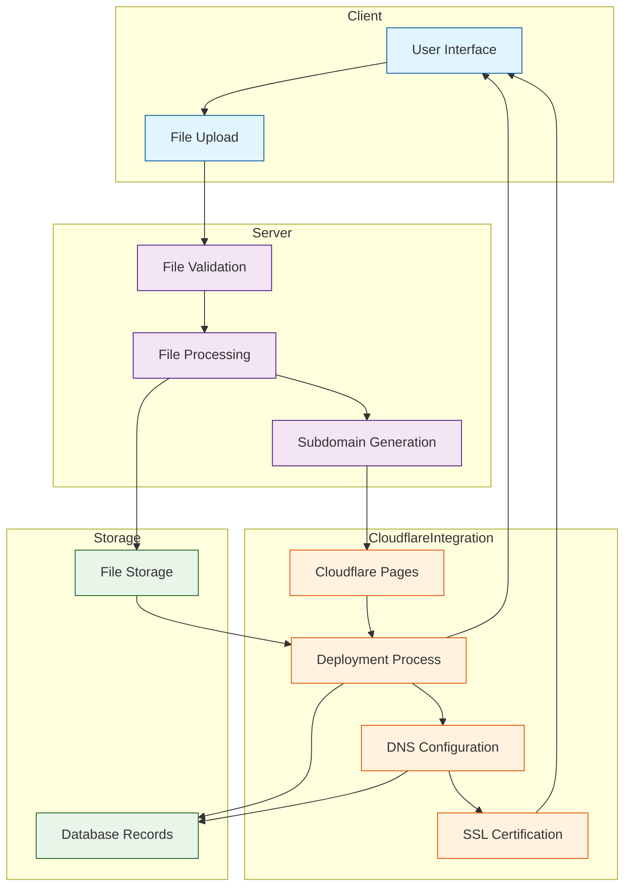

# WarpHost System Architecture

## Diagram Components

### Client Side
- **User Interface**: Main web interface for user interactions
- **File Upload**: Handles ZIP file uploads from users

### Server Processing
- **File Validation**: Checks file integrity and content
- **File Processing**: Extracts and prepares files for deployment
- **Subdomain Generation**: Creates unique subdomains

### Cloudflare Integration
- **Cloudflare Pages**: Manages Pages projects
- **Deployment Process**: Handles asset deployment
- **DNS Configuration**: Sets up CNAME records
- **SSL Certification**: Manages SSL certificates

### Storage
- **File Storage**: Temporary storage for uploaded files
- **Database Records**: Stores deployment information